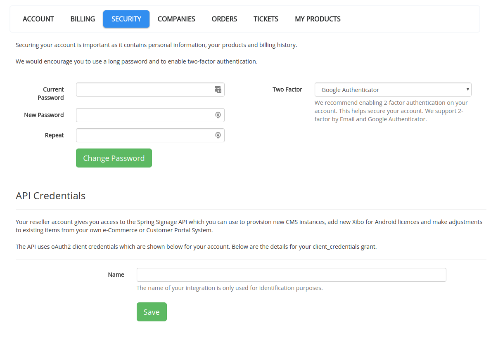
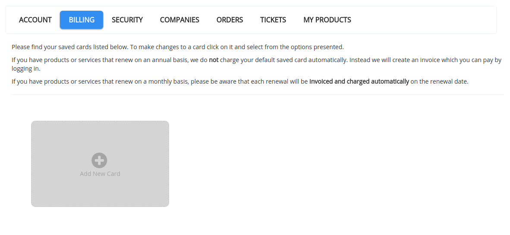

# Introduction

Xibo Signage provide an API for integrating the Xibo Platform into your own website or systems. The API can be used to query for details about your account, licence or cloud usage and make changes, such as provisioning a new CMS instance. **The Platform API is available to members of the [Channel Partner Program](https://xibo.org.uk/become-a-partner)**.

This is **not the Xibo CMS API**, details for which can be found in the [developer documentation](https://xibo.org.uk/docs/developer/integrating-with-xibo).

The Xibo Platform API is a REST API designed to have intuitively named resource locations, JSON responses and HTTP response codes to indicate status. All requests must be made over HTTPS.

There is a live and test environment.

This library written for PHP aims to simplifies interaction with the API, by publishing an oAuth2 Provider to manage access and Entities to represent common operations.

## Managing API Access
Before using the Xibo Platform API you will need to understand how the API fits your channel partner business, how we make sure no-one is able to gain access to your account through the API and how you can test your integration in a safe way.

We will cover the following things:

- Live mode and testing
- API Keys
- Billing

### Live mode and testing

There are two separate environments for things you want to happen "for real" and things you are still testing. All API requests exist in either the live or test environment and they don't mix together. There is a separate address and set of API keys for each environment.

Transactions that happen in the live environment will effect your live account and therefore effect your customers and/or billing. For example if you create a new order for a CMS instance in the live environment, your account will be charged and the CMS instance created - the exact same transaction in the test environment would only "pretend" to create the CMS and charge your account.

 - Live: https://xibo.org.uk/api
 - Test: https://test.xibo.org.uk/api
 - If you use the PHP oAuth2 provider the connect details are managed for you

### API Keys

Your API keys are stored securely in your account and can be "refreshed" at any time if you think someone else may have copied them. When you first open an account the `clientId` and `clientSecret` will be empty and you will need to provide a name for your integration and click save to get both keys.

We strongly recommend that both keys remain secret, but at the least the `clientSecret` must be private at all times.

To enable your integration and get your API keys please visit the "My Account" -> Security section of the customer portal (remember to use the test one first) and name your integration - see below for an example.

### Billing
In many cases the goal of integration is to minimise or eliminate manual actions, therefore it is often desirable for you to automate payment of Orders, which is done by saving your card details in your account. Monthly billing of CMS instances require a saved card, for other Orders it is optional and we will email you an invoice with payment link if you do not have a saved payment method, or if that method fails to authorise.

You will find the option to save a card on the Billing tab of "My Account", shown below:

Please note that all card details are stored by our payment processor (Stripe.com). Xibo Signage do not store your card details.

[Continue to Authentication](authentication.md)

